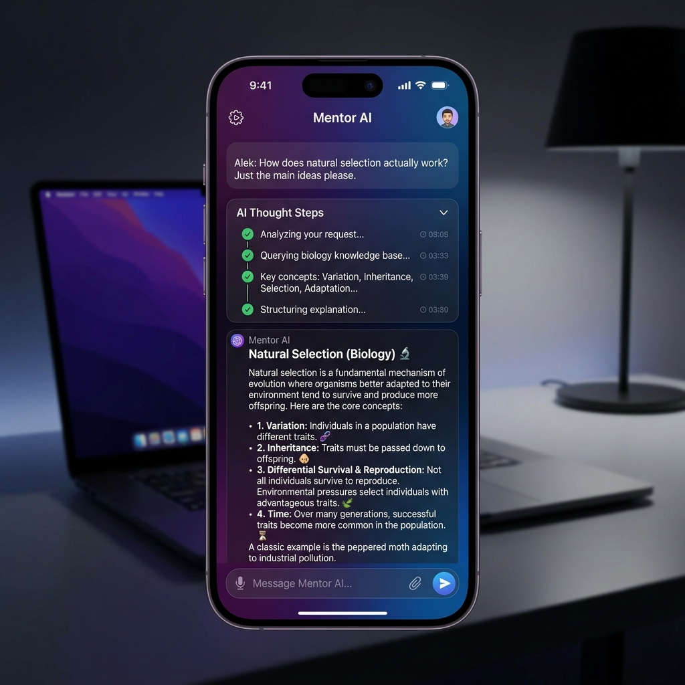

# 📖 星火 AI 智能学习伴读助手 (Spark AI Study Assistant)

> Week 4 综合大项目：一款集成了 **PDF RAG (检索增强生成) 伴读** 与 **智能学习大纲规划 Agent** 的端到端闭环移动端应用。

本项目由 **SwiftUI 移动客户端** 与 **Python FastAPI 异步服务端** 组成。客户端采用 Swift 现代并发原生解析 SSE (Server-Sent Events) 流式推送；服务端搭载了 ChromaDB 本地向量库，并支持 ReAct 智能体（Agent）中间推理决策链的可视化泵送。

---

## 📱 移动端界面预览 (Aesthetics Mockup)

下面是客户端在 iOS 模拟器上运行时的界面视觉效果。AI 的思考过程（Thought ➔ Action ➔ Observation）以精美的**状态时间轴时间链**实时滚动展示，下方打字机流式生成定制的学习大纲：



---

## 🏗️ 整体系统架构图 (Architecture)

以下是本项目的数据流与控制流的系统架构设计图：

```mermaid
graph TD
    User([👤 用户]) -->|输入提问/导入PDF| App[🍏 SwiftUI 移动客户端]
    
    subgraph Client [端侧 SwiftUI]
        App -->|AsyncSequence 流式解析| RAGMgr[RAGManager 状态管理]
    end

    RAGMgr -->|"POST /upload (Multipart)"| BE_Upload[FastAPI: PDF 解析与向量建库]
    RAGMgr -->|"POST /stream_query (SSE)"| BE_Query[FastAPI: RAG 伴读流]
    RAGMgr -->|"POST /stream_agent (SSE)"| BE_Agent[FastAPI: Agent 规划流]

    subgraph Backend [FastAPI 后端脑回路]
        BE_Upload -->|RecursiveSplitter| Chunks[文本切片]
        Chunks -->|Embedding API| DB[(ChromaDB 本地向量库)]
        
        BE_Query -->|1. Query Rewrite| LLM[🧠 DeepSeek 大模型底座]
        BE_Query -->|2. Semantic Search| DB
        BE_Query -->|3. Context Fusion| LLM
        
        BE_Agent -->|ReAct 规划循环| AgentLoop{ReAct 状态机}
        AgentLoop -->|1. Thought 思考| AgentLoop
        AgentLoop -->|2. Action 调工具| Tools[物理工具箱]
        Tools -->|search_web 联网搜索| DDG[🔍 DuckDuckGo API]
        Tools -->|calculator 安全计算| Calc[🧮 本地计算器]
        AgentLoop -->|3. Observation 观测| AgentLoop
        AgentLoop -->|4. Final Answer 最终大纲| LLM
    end

    BE_Query -.->|data: {"type": "content", "delta": "字块"}|\n\n RAGMgr
    BE_Agent -.->|data: {"type": "thought/action/observation/content"}|\n\n RAGMgr
```

---

## ✨ 核心特性 (Key Features)

### 1. 📖 PDF 伴读 Copilot (RAG)
*   **沙盒特权文件导入**：iOS 端使用 `.fileImporter` 与安全特权机制，直接将教材 PDF 字节流以 Multipart 形式发往后端。
*   **内存流建库**：后端在内存中直接使用 PDFReader 解析，不产生临时磁盘垃圾，自动通过 langchain-text-splitters 切片存入本地 ChromaDB 数据库。
*   **白盒引用证据抽屉**：客户端具备引文展示抽屉，展示检索词改写结果与 top-3 的参考原始文本切片，消除 AI 幻觉，提供透明依据。

### 2. 🗺️ 智能学习计划生成器 (Agent)
*   **ReAct 自主决策链**：后端手写“思考-行动-观察”状态机循环，使用 API `stop_words` 阻断大模型自我幻觉，将控制权精确收回 Python 执行器。
*   **物理工具箱集成**：Agent 搭载了真实的联网搜索引擎与数学计算器，支持多步级联推理（例如：先搜出最新大纲天数，再计算每天学习比重）。
*   **推理过程可视化推送**：后端将中间思考步骤包装为 SSE 自定义帧实时发送，客户端使用齿轮旋转动画、状态点变色等动态渲染 AI 规划轨迹。

### 3. 🌊 原生高性能 SSE 泵送流
*   **零外部依赖**：服务端直接基于 FastAPI Native `StreamingResponse` 泵送 event-stream。
*   **Swift 异步序列消费**：iOS 端使用 iOS 15 引入的 **`URLSession.AsyncBytes`** (`bytes.lines`)，以 reactive 响应式风格实现无三方库依赖的原生流解析，性能极佳。

---

## 🛠️ 技术栈 (Technology Stack)

*   **iOS 客户端**：Swift 5.10 / SwiftUI / Combine / URLSession Concurrency
*   **服务端**：Python 3.12 / FastAPI / Uvicorn / ChromaDB 0.4 / LangChain Core / pypdf / duckduckgo-search
*   **大模型底座**：DeepSeek-V3 (支持官方 API 与 硅基流动 双通道灾备降级)

---

## 🏃‍♂️ 快速开始 (Getting Started)

### 1. 后端服务启动
1.  进入后端目录：
    ```bash
    cd backend
    ```
2.  配置环境变量：
    新建 `.env` 文件并填入您的大模型 API 密钥（DeepSeek 官方或硅基流动）：
    ```env
    DEEPSEEK_API_KEY=sk-your-key-here
    # 或者
    # SILICONFLOW_API_KEY=sk-your-key-here
    ```
3.  一键热安装依赖并运行：
    ```bash
    uv run python main.py
    ```
    服务成功启动后会在本地 `http://127.0.0.1:8000` 监听。

### 2. iOS 客户端运行
我们推荐使用 **XcodeGen** 自动化工具一键生成并配置 Xcode 项目：
1.  确保您的 Mac 上已安装 `xcodegen`（如未安装，可运行 `brew install xcodegen` 安装）。
2.  在项目根目录下，直接在终端执行：
    ```bash
    xcodegen
    ```
    这会在根目录下自动生成 `SparkCopilot.xcodeproj` 项目文件，并自动配置好了所有的全屏、网络及文件权限。
3.  使用 Xcode 打开 `SparkCopilot.xcodeproj`。
4.  在 Xcode 中选择一个模拟器（如 iPhone 16 Pro），按 **`Cmd + R`** 启动运行即可！

